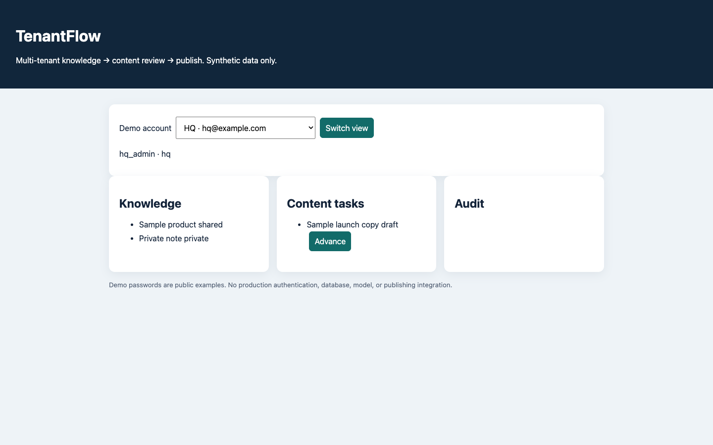
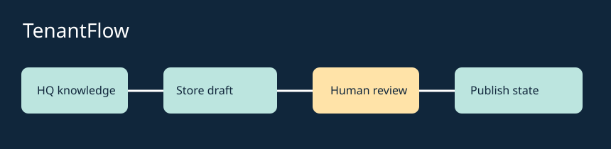

# TenantFlow · multi-tenant AI workflow SaaS

**A runnable workflow demo for tenant-scoped knowledge and human-gated publishing.** It solves the problem of showing who can see, review and release shared content without crossing tenant boundaries.

**LIVE_DEMO** · [Try the browser workflow](https://zhouey314-cloud.github.io/multi-tenant-ai-workflow-saas/) · [Case study](docs/case-study.md) · [Resume bullets](docs/resume-bullets.md) · [Interview notes](docs/interview-notes.md)

**Status:** interactive synthetic browser demo · policy tests 10/10 · no production authentication or model integration.

> Independent clean-room portfolio demo. Synthetic organizations, knowledge and content. No company source, UI or customer data.

## Demo

**Live Demo:** <https://zhouey314-cloud.github.io/multi-tenant-ai-workflow-saas/>. It runs in your browser using the same `src/core.js` policy functions as the local API. Data is synthetic, persists only in that browser, and can be reset at any time. Demo logins: `hq@example.com` / `demo-hq-only`, `store@example.com` / `demo-store-only`, `review@example.com` / `demo-review-only`. These public passwords are role selectors, **not security controls**.

Local: Node 23+, `npm test`, then `npm start` and open <http://localhost:8788>.

### Try these scenarios

1. HQ creates private knowledge → switch to Store: it is hidden.
2. HQ creates shared knowledge → switch to Store: it is visible and usable as grounding.
3. Store creates a draft and submits it → Reviewer approves or rejects → HQ can publish an approved task. Inspect the who/when/action/entity audit; then click **Reset Demo Data**.

## Problem and design

Show how enterprise knowledge can flow from HQ to a store while private items remain isolated and content passes a human review gate. [Architecture, data model, RBAC and state machine](docs/architecture.md) describe each permission. `src/core.js` is the single policy source for both `src/server.ts` and `web/app.js`; the latter is deployed statically on GitHub Pages. Local API JSON storage and browser localStorage are separate demo adapters.

## Features and verification

Tenant filtering, parent to child shared knowledge, private records, task transitions, audit trail, synthetic seed and ten offline tests. The baseline was 7/7; the V3 suite is 10/10 with HQ/store visibility, explicit reject and audit isolation. These are deterministic mechanics checks, not a model eval or security certification. No AI provider is connected; task generation is a workflow placeholder. Run `npm test`. See [resume bullets](docs/resume-bullets.md) and [interview notes](docs/interview-notes.md).

## Status and limitations

`IMPLEMENTED_AND_TESTED` for the shared policy, browser interactions and state machine. `MOCK` for login and seed. `NOT_IMPLEMENTED` for real authentication, Postgres, external AI, email and publishing. The browser downloads the synthetic dataset; its role filters demonstrate policy behavior but do **not** secure real confidential data. Do not use this demo for real tenants. Production roadmap: authenticated sessions, transaction-scoped tenant filtering, row-level security, migration tests, immutable audit and human-approved provider evaluations.

## Security and privacy

All identities and content are fabricated. The local API binds to `127.0.0.1`; the online demo is a static browser app with public seed data and localStorage. Neither should hold sensitive data. MIT license.
